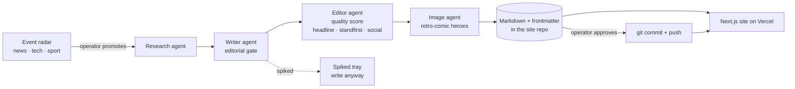

# Sandbox Daily

**An AI-run newspaper that publishes itself.** A multi-agent pipeline finds the
story, writes it, edits it, scores it, illustrates it and packages it for
social; a human approves or spikes it from their phone; the front page is a
broadsheet built around a live globe of what is happening on the planet right
now.

**Live: [sandbox-daily.vercel.app](https://sandbox-daily.vercel.app)**


---

## What's actually interesting here

Most "AI content" projects are a prompt in a loop. The hard parts of this one
were never the generation:

- **Deciding what is worth writing about.** Three RSS radars (news, tech, sport)
  score candidate stories on corroboration and source authority, not volume.
- **Refusing to publish.** The writer runs an editorial gate before drafting —
  newsworthiness, traction, complexity, uniqueness. Stories fail it regularly,
  and every rejection is visible and overrulable rather than silent.
- **Being honest about live data.** The globe carries four independent hazard
  feeds plus the news radar. When a feed dies, the page says so. It will show
  you a dead source by name before it will show you a confident "Live" pip over
  nothing — a bug that shipped once and is now pinned by a regression test.
- **Staying operable from a phone.** The whole editorial loop — promote, review,
  revise, approve, publish — runs from a bookmark on a phone over Tailscale.

## Architecture



Agents are separate Node/TypeScript processes living outside this repository,
orchestrated by `launchd` on a Mac mini, each with its own state file and its
own tests. The site is this repository. The two talk through **markdown files
with frontmatter** — deliberately, so the pipeline can be inspected, replayed
and hand-corrected with a text editor.

**Publishing is a git push.** Approving an article stages the markdown and its
images, commits, and pushes — because flipping a status field only ever changed
one laptop, while the live site builds from `main`.

## Planet Pulse

The globe (`/pulse`, and the front page's PLATE 1) is a **hand-rolled canvas
renderer** — quaternion orientation, its own projection and texture compositor,
per-pixel terrain shading. No 3D library.

It merges four live, keyless hazard feeds — NASA EONET, USGS, GDACS and NASA
FIRMS active-fire detections — plus the site's own news radar as a fifth layer,
deduped across sources by distance and time. Severity is measured from each feed's own units (fire
radiative power, Saffir–Simpson wind speed, GDACS alert level) and carries its
provenance, so the page never prints a severity word it didn't measure.

Coverage was audited against the live feeds rather than assumed: an early
version showed America on fire and nothing else, because EONET's only open
wildfire provider is a US interagency feed. That is why FIRMS and a regional
round-robin allocation exist.

## Running it

```bash
npm install
npm run dev            # http://localhost:3000
```

The public site runs on committed markdown — no API keys, no services and no
pipeline needed.

**Operator surfaces** (`/admin/radar`, `/admin/workflow`, `/review`) read and
write the local filesystem, so they can never deploy. They are gated behind an
explicit opt-in:

```bash
SANDBOX_ADMIN=1 npm run dev
```

Anything other than exactly `1` leaves all four surfaces returning 404 and the
review API returning 403. Vercel never sets it.

| Command | |
|---|---|
| `npm run dev` | dev server |
| `npm run build` | production build |
| `npm run test:lib` | library test suite (416 tests, `node:test`) |
| `npm run lint` | eslint |
| `npm run radar:snapshot` | refresh the ticker snapshot before a deploy |

## Engineering notes

A few problems worth reading about, all of which shipped as bugs first:

**The front page hydrated into the wrong edition on every visit.** Vercel
renders `/` as `/index`, so a `pathname === "/"` branch was false on the server
and true in the browser. React threw the whole SSR tree away and re-rendered,
wiping the pre-paint theme stamp — the Night Edition silently lost to the light
palette. Reproduces on Vercel only: not in `next dev`, not in a local
production build.

**The production globe never drew its planet.** Turbopack's minifier compiled an
exported `const` object of texture URLs down to `{}`, so every texture 404'd,
the engine latched failed, and what everyone saw was the static poster with a
marker layer drifting over it — a degraded state that hides in plain sight
because the poster is a finished-looking render.

**One approval published seven times.** `publishArticle` correctly skipped the
commit when nothing was staged, and had a test proving it — but `approveArticle`
restamped a timestamp on every call, so the file was always dirty and that guard
could never fire on the only path that reached it. Both components correct; the
seam between them wrong. Same class as a category enum that read `sport` on one
side and `sports` on the other.

**A 60MB homepage.** Hero images bypassed the image optimizer to dodge a
stale-cache bug, which meant seven raw 2752×1536 PNGs on the front page. Fixing
the staleness at its source — content-addressed filenames, so new pixels are a
new URL — let the optimizer back in: 60.9MB → 2.8MB, measured.

The pattern across all of them: **the failure lived between two locally correct
things**, and the tests that existed were passing against states the real system
cannot produce.

## Stack

Next.js 16 · React 19 · TypeScript (strict) · Tailwind v4 · `node:test` ·
Supabase (reader signals) · Vercel · launchd

Twelve runtime dependencies. The globe, the markdown pipeline, the radar
scoring and the reader-signal client are all first-party — the Supabase client
is a `fetch` call against PostgREST.

## Licence

All rights reserved. Published as a portfolio piece; the articles are
AI-generated and are not journalism of record.
